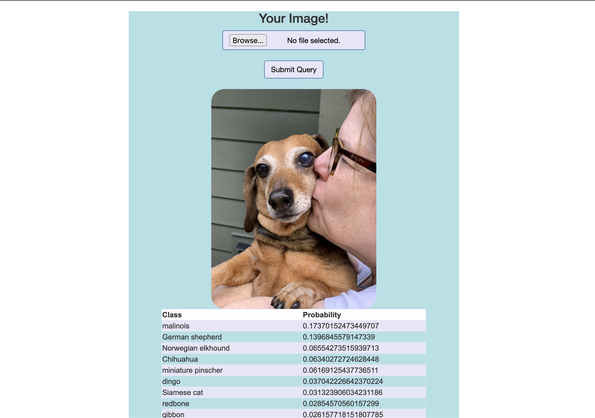

# ResNet-Flask-Web-App
A flask web app which takes in a user's image and passes it through ResNet18. This uses PyTorch to download the resnet18 weights. 

 Given an image, the model will predict what the image is of using the ResNet18 labels. It will display the top 100 guesses and with each of the probabilities that it is that thing. 
 

Here's the output (featuring my dog Baby):

